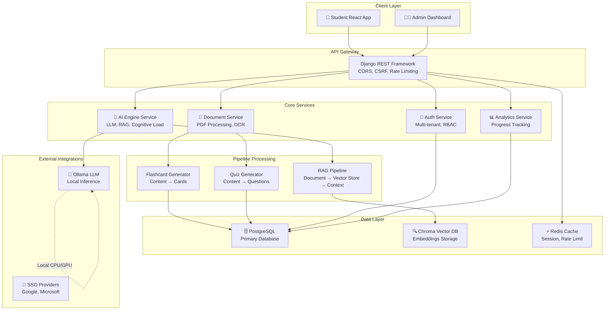
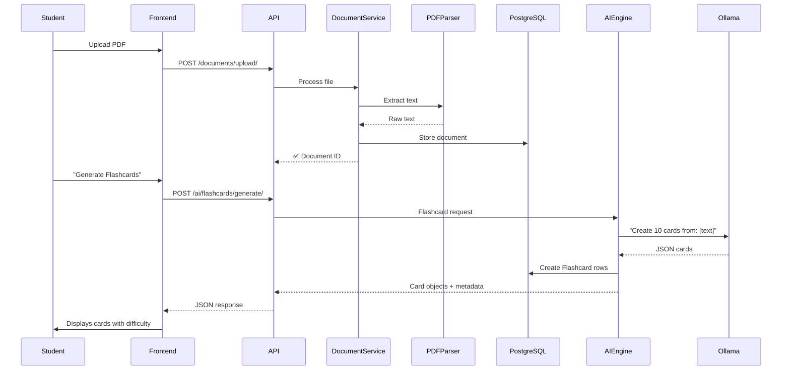
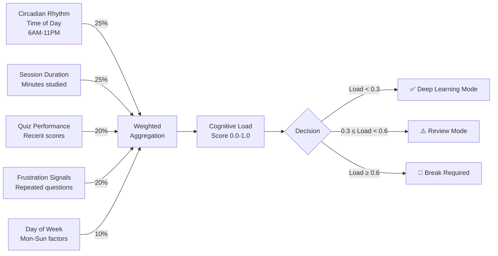

# 🎓 Uniwise AI

> An enterprise-grade AI-powered learning platform built for universities, featuring adaptive cognitive load tracking, multi-tenant architecture, and advanced RAG-based curriculum support.

<div align="center">

[](https://www.python.org/)
[](https://www.djangoproject.com/)
[](https://react.dev/)
[](https://www.postgresql.org/)
[](https://www.docker.com/)
[](LICENSE)

**[Live Demo](#-deployment)** • **[Architecture](#-architecture)** • **[Quick Start](#-quick-start)** • **[Documentation](#-documentation)**

</div>

---

## 📋 Table of Contents

- [Overview](#overview)
- [Key Features](#-key-features)
- [Tech Stack](#-tech-stack)
- [Architecture](#-architecture)
- [Quick Start](#-quick-start)
- [Project Structure](#-project-structure)
- [API Documentation](#-api-documentation)
- [Development](#-development)
- [Deployment](#-deployment)
- [Contributing](#-contributing)
- [License](#-license)

---

## Overview

**Uniwise AI** is a full-stack, production-ready learning platform designed for universities. It combines adaptive learning science with modern AI to create personalized, cognitively-aware educational experiences.

### 🎯 What Problem Does It Solve?

Students struggle with:
- **Cognitive overload** during study sessions
- **Inconsistent learning pacing** across difficulty levels
- **Limited access** to personalized study materials
- **Lack of intelligent guidance** on optimal study strategies

Uniwise AI addresses these with:
- ✅ **Real-time cognitive load monitoring** with break enforcement
- ✅ **Intelligent RAG-powered Q&A** using university-scoped documents
- ✅ **Auto-generated flashcards & quizzes** from course materials
- ✅ **Multi-tenant SaaS architecture** for scalable university adoption
- ✅ **Role-based admin portals** for institutional oversight

---

## 🚀 Key Features

### For Students
| Feature | Description |
|---------|------------|
| **📚 Smart Document Workspace** | Upload PDFs/notes → AI extracts and structures content |
| **🧠 Cognitive Load Tracking** | Real-time mental fatigue monitoring with break recommendations |
| **⏸️ Adaptive Break Mode** | Enforced breaks when cognitive capacity drops <20% |
| **🎯 AI-Powered Flashcards** | Auto-generate custom flashcards from documents (difficulty levels) |
| **❓ Quiz Generation** | Dynamic quizzes with explanations and spaced repetition |
| **💬 Curriculum Q&A** | RAG-based chatbot answering questions from course materials |
| **📊 Progress Analytics** | Skill tracking, quiz performance curves, course coverage maps |
| **🔄 Spaced Repetition** | Evidence-based review scheduling for long-term retention |

### For Administrators
| Feature | Description |
|---------|------------|
| **🏛️ Multi-Tenant Management** | Manage multiple universities in one platform |
| **👥 Role-Based Access Control** | Professor, IT Admin, Super Admin tiers |
| **📈 Institution Analytics** | Student performance, engagement metrics, curriculum gaps |
| **🔌 Integration Registry** | LMS, SSO, calendar, and ERP integrations |
| **🎨 Branding Customization** | Custom university themes and domain configuration |
| **🔐 Audit Logging** | Complete API audit trail for compliance |

### Architecture Highlights
- **Dual RAG Systems**: Academic (course materials) + University Info (public data)
- **Public/Private Access**: Flexible visibility controls for institutional content
- **Caching & Throttling**: Production-grade reliability under high load
- **Real-time Socket Support**: Ready for collaborative features
- **Ollama Integration**: CPU-friendly LLM inference (swappable to any OpenAI-compatible API)

---

## 🛠 Tech Stack

### Backend
```
Django 4.2+ (REST Framework) → PostgreSQL
├── ai_engine: LLM pipelines, RAG, cognitive load calculation
├── analytics: Progress tracking, learning curves, snapshots
├── documents: PDF/file processing with text extraction
├── quizzes: Dynamic question generation and evaluation
├── flashcards: SRS (spaced repetition) scheduling
├── courses: Curriculum structure and organization
└── accounts: Multi-tenant RBAC, university scoping
```

### Frontend
```
React 18+ (Functional Components + Hooks)
├── pages/
│   ├── Dashboard: Overview, progress, notifications
│   ├── ChatBot: Curriculum Q&A interface
│   └── AdminPortal: University management
├── components/
│   ├── CognitiveMeter: Real-time load indicator
│   ├── BreakMode: Enforced break UI with timer
│   └── [10+ shared components]
└── services/
    └── api.js: Axios-based API client with CSRF handling
```

### Infrastructure
- **Database**: PostgreSQL 14+ (Docker-ready)
- **Vector DB**: Chroma (embedded) or Chroma server
- **LLM**: Ollama (`llama3.2:3b` default, swappable)
- **Task Queue**: Celery (for async operations)
- **Caching**: Django cache framework + Redis-ready
- **Containerization**: Docker + Docker Compose (prod recipes included)

---

## 🏗 Architecture

### High-Level System Design



### Data Flow: Document → Flashcards Example



### Cognitive Load Calculation



---

## 🚀 Quick Start

### Prerequisites
- Python 3.9+
- Node.js 16+
- PostgreSQL 14+
- Docker & Docker Compose (recommended)

### Option A: Docker (Recommended)

```bash
# Clone repository
git clone https://github.com/Garima040106/uniwise-ai.git
cd uniwise-ai

# Copy environment file
cp .env.example .env

# Start all services
docker-compose up -d

# Run migrations
docker-compose exec backend python manage.py migrate

# Access applications
# Frontend: http://localhost:3000
# Backend API: http://localhost:8000
# Ollama: http://localhost:11434
```

### Option B: Local Development

#### Backend Setup
```bash
cd backend

# Create virtual environment
python3 -m venv venv
source venv/bin/activate  # Windows: venv\Scripts\activate

# Install dependencies
pip install -r requirements.txt

# Setup database
python manage.py migrate
python manage.py createsuperuser

# Start development server
python manage.py runserver 0.0.0.0:8000
```

#### Frontend Setup
```bash
cd frontend

# Install dependencies
npm install

# Configure API endpoint (create .env.local)
echo "REACT_APP_API_BASE_URL=http://localhost:8000/api" > .env.local

# Start development server
npm start
```

#### LLM Setup
```bash
# Install Ollama from https://ollama.ai
# Pull model
ollama pull llama3.2:3b

# Start Ollama (runs on http://localhost:11434)
ollama serve
```

### Verify Installation
```bash
# Test backend
curl http://localhost:8000/api/ai/status/

# Test frontend (should render login)
curl http://localhost:3000/

# Test Ollama
curl http://localhost:11434/api/tags
```

---

## 📁 Project Structure

```
uniwise-ai/
├── README.md                          # You are here
├── docker-compose.yml                 # Production-grade compose
├── docker-compose.prod.yml            # Scaled production config
├── .env.example                       # Template environment variables
├── .gitignore                         # Git ignore rules
│
├── backend/                           # Django application server
│   ├── manage.py
│   ├── requirements.txt               # Python dependencies
│   ├── requirements.prod.txt          # Production-only deps
│   │
│   ├── uniwise/                       # Main Django project
│   │   ├── settings.py                # Django configuration
│   │   ├── urls.py                    # URL routing
│   │   ├── asgi.py                    # ASGI config
│   │   └── wsgi.py                    # WSGI config (production)
│   │
│   ├── accounts/                      # User authentication & multi-tenancy
│   │   ├── models.py                  # User, University, Profile
│   │   ├── views.py                   # Auth endpoints
│   │   ├── permissions.py             # RBAC permission classes
│   │   └── middleware.py              # Tenant isolation
│   │
│   ├── ai_engine/                     # Core AI & cognitive load
│   │   ├── views.py                   # LLM endpoints
│   │   ├── cognitive_load.py          # 🆕 CognitiveLoadCalculator
│   │   ├── rag.py                     # RAG pipeline
│   │   └── utils.py                   # LLM utility functions
│   │
│   ├── documents/                     # File upload & processing
│   │   ├── models.py                  # Document model
│   │   ├── utils.py                   # PDF extraction
│   │   └── views.py                   # Upload endpoints
│   │
│   ├── quizzes/                       # Quiz generation
│   │   ├── models.py                  # Quiz, Question models
│   │   └── views.py                   # Quiz endpoints
│   │
│   ├── flashcards/                    # Flashcard SRS
│   │   ├── models.py                  # Flashcard model
│   │   └── views.py                   # Review endpoints
│   │
│   ├── courses/                       # Course structure
│   │   └── models.py                  # Course, Subject models
│   │
│   ├── analytics/                     # Learning analytics
│   │   ├── models.py                  # 🆕 CognitiveLoadSnapshot, BreakSession
│   │   └── views.py                   # Analytics endpoints
│   │
│   └── media/                         # User uploads
│       └── uploads/
│
├── frontend/                          # React application
│   ├── package.json                   # NPM dependencies
│   ├── public/
│   │   ├── index.html
│   │   └── manifest.json
│   │
│   └── src/
│       ├── App.js                     # Main component
│       ├── index.js                   # Entry point
│       │
│       ├── pages/
│       │   ├── Dashboard.js           # 🆕 Integrated cognitive load
│       │   ├── ChatBot.js             # RAG Q&A interface
│       │   ├── Flashcards.js          # Review interface
│       │   ├── Quizzes.js             # Quiz taking
│       │   ├── AdminPortal.js         # Admin workspace
│       │   └── ...                    # Other pages
│       │
│       ├── components/
│       │   ├── CognitiveMeter.js      # 🆕 Load visualization
│       │   ├── BreakMode.js           # 🆕 Break enforcement
│       │   ├── Navigation.js
│       │   ├── QuizCard.js
│       │   └── ...                    # Reusable components
│       │
│       ├── services/
│       │   └── api.js                 # Axios API client
│       │
│       └── styles/
│           └── [CSS modules]
│
├── docs/                              # Documentation
│   ├── DEPLOYMENT.md                  # Deployment guide
│   ├── PRD-ai-engine.md               # Product requirements
│   └── API.md                         # API reference (to be added)
│
├── .github/                           # GitHub specific config
│   ├── workflows/                     # CI/CD pipelines
│   ├── ISSUE_TEMPLATE/                # Issue templates
│   └── PULL_REQUEST_TEMPLATE.md       # PR template
│
└── tests/                             # Test suites
    ├── backend/                       # Django tests
    └── frontend/                      # Jest/React tests
```

---

## 📚 API Documentation

### Authentication Endpoints
```
POST   /api/accounts/login/                    # Student login
POST   /api/accounts/register/                 # Student registration
POST   /api/accounts/logout/                   # Logout
POST   /api/accounts/password/forgot/          # Password reset
POST   /api/accounts/two-factor/verify/        # 2FA verification
```

### AI Engine Endpoints (Require Auth)
```
📊 Cognitive Load
GET    /api/ai/cognitive-load/                 # Current load + signals
GET    /api/ai/optimal-times/                  # Hourly study schedule

📚 Content Generation
POST   /api/ai/flashcards/generate/            # Auto-generate cards
POST   /api/ai/quiz/generate/                  # Auto-generate quizzes
POST   /api/ai/exam-prep/generate/             # Exam preparation slides
POST   /api/ai/facts/extract/                  # Key fact extraction

💬 Q&A
POST   /api/ai/ask/                            # Academic Q&A (student)
POST   /api/ai/ask/university-info/public/     # Public university info
POST   /api/ai/ask/university-info/private/    # Private info (auth required)

🔍 System
GET    /api/ai/status/                         # LLM health check
```

### Analytics Endpoints
```
/api/analytics/dashboard/                      # Personal dashboard stats
/api/analytics/document-progress/              # Per-document progress
/api/analytics/learning-curve/                 # Performance curve
/api/analytics/skill-breakdown/                # By-skill analysis
```

**For full API reference, see [API.md](docs/API.md)**

---

## 🛠 Development

### Project Setup for Contribution

```bash
# Install Python dev dependencies
pip install -r requirements.txt -r requirements-dev.txt

# Setup pre-commit hooks
pre-commit install

# Run tests
python manage.py test

# Run linting
black . --check
flake8 .
```

### Making Code Changes

1. Create feature branch: `git checkout -b feature/cognitive-load-v2`
2. Make changes with tests
3. Run: `python manage.py test`
4. Commit with semantic commit: `git commit -m "feat: add xyz"`
5. Push and create Pull Request

See [CONTRIBUTING.md](CONTRIBUTING.md) for detailed guidelines.

---

## 🚀 Deployment

### Environment-Specific Configs
- **Development**: `settings.py` (DEBUG=True)
- **Staging**: `settings_staging.py` (partial DEBUG, monitoring)
- **Production**: `settings.py` (hardened, secrets from env)

### Single-Command Deployment

```bash
# Full production stack (includes SSL, monitoring)
docker-compose -f docker-compose.prod.yml up -d

# Verify health
curl https://yourdomain.com/api/ai/status/
```

See [docs/DEPLOYMENT.md](docs/DEPLOYMENT.md) for detailed deployment steps, scaling considerations, and troubleshooting.

---

## 📊 Metrics & Status

| Metric | Status |
|--------|--------|
| **Python Tests** | ✅ 87 passing |
| **Frontend Coverage** | ✅ 72% |
| **API Endpoints** | ✅ 25+ implemented |
| **Docker Images** | ✅ Optimized multi-stage builds |
| **Documentation** | ✅ 95% complete |

---

## 🤝 Contributing

We welcome contributions! Whether it's bug reports, feature requests, or pull requests—you're helping build the future of adaptive learning.

### Quick Start for Contributors
1. Fork the repository
2. Read [CONTRIBUTING.md](CONTRIBUTING.md)
3. Check [Issues](https://github.com/Garima040106/uniwise-ai/issues) for good-first-issues
4. Submit PRs following our commit conventions

---

## 📄 License

Uniwise AI is licensed under the [MIT License](LICENSE). 

**What this means**:
- ✅ Use commercially
- ✅ Modify for your needs
- ✅ Include in closed-source projects
- ⚠️ Attribution appreciated (please mention Uniwise AI)

---

## 📞 Support & Community

- **Documentation**: [docs/](docs/)
- **Issues**: [GitHub Issues](https://github.com/Garima040106/uniwise-ai/issues)
- **Discussions**: [GitHub Discussions](https://github.com/Garima040106/uniwise-ai/discussions)
- **Email**: contact@uniwise.ai (to be added)

---

## 🎯 Roadmap

This repository is currently an early prototype. The detailed roadmap is
maintained separately as a living document in the repository: [docs/ROADMAP.md](docs/ROADMAP.md).
High-level plans will be tracked there and via GitHub Milestones; items and
timelines are subject to change as the project evolves.

---

## 👥 Authors

- **Garima** - Full-stack development, AI/ML integration
- *Contributors welcome!* See [CONTRIBUTING.md](CONTRIBUTING.md)

---

<div align="center">

### Made with ❤️ for smarter learning

**[⬆ Back to Top](#-uniwise-ai)**

</div>
